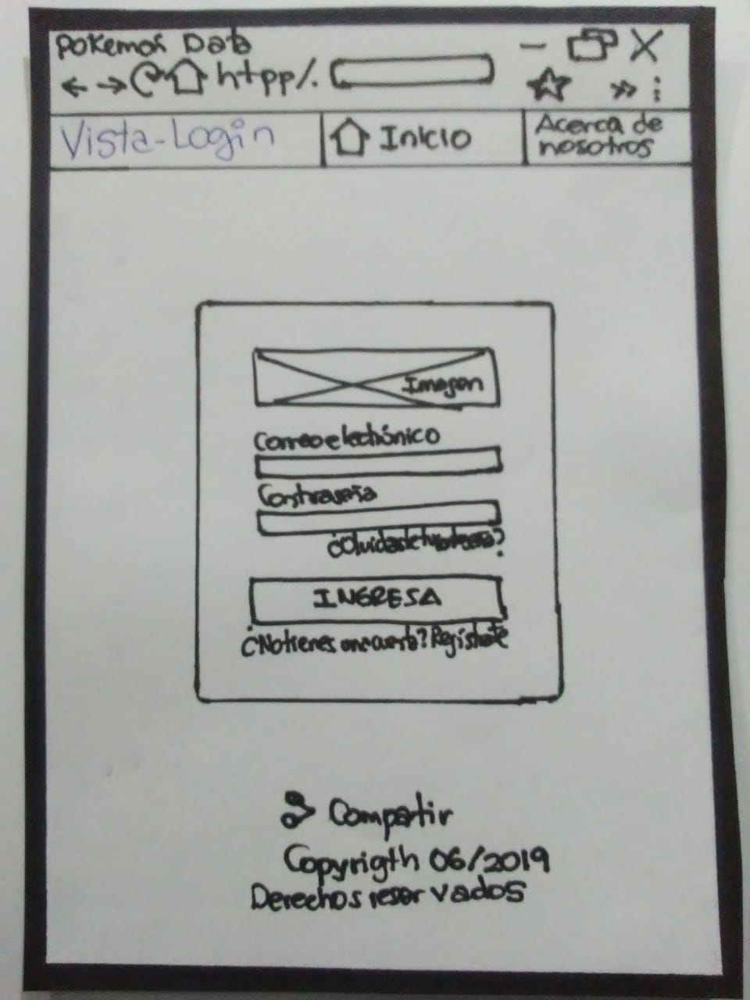
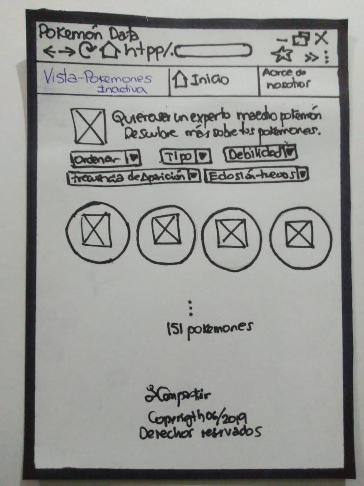
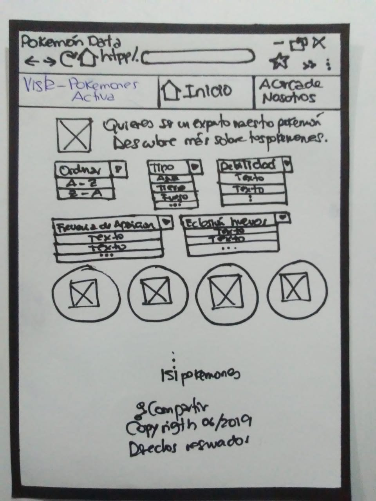
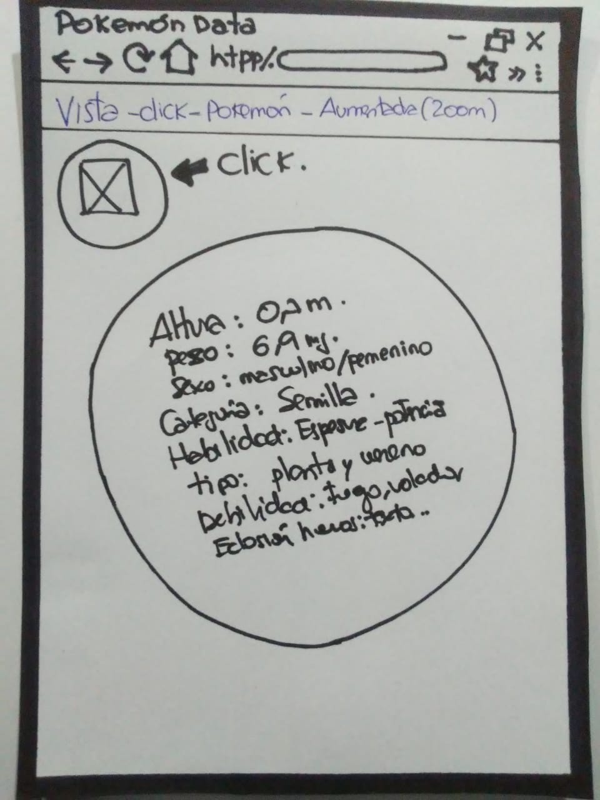

# Data Lovers

# DISEÑO UX

# POKEMON STORY

**--------.>GUÍA COMPLETA<----------**

**-----ETAPA 1: INVESTIGACIÓN**

. INTRODUCCION A POKEMON GO

.HISTORIAS DE USUARIO

**-----ETAPA 2: ORGANIZACIÓN**

.FLUJOGRAMAS

**------ETAPA 3: PROTOTIPADO**

.BAJA Y ALTA FIDELIDAD CON FUNCIONALIDADES

**------ETAPA 4: PRUEBAS A PÚBLICO ESPECÍFICO**

Informes evaluativos y testeos

**------ETAPA 5: DISEÑO**

.Fuentes para diseñar  y aplicar interacción y estilos

**------ETAPA: 6 LANZAMIENTO**

**//ETAPA 1: INVESTIGACIÓN//**

**A) HISTORIA DE POKEMON EN UNOS SEGUNDOS--->**

            (IMAGEN)

**B)¿DE QUÉ TRATA Y CÓMO FUNCIONA POKEMON GO?---->**

   VIDEO(https://www.youtube.com/watch?v=mSXL3FYC7qM  (Guia Sencilla y rapida))

**C) HISTORIAS DE USUARIO---->**

**(HISTORIA 1)**

Como usuaria quiero poder loguearme para acceder al sitio web.

**(HISTORIA 2)**

Como usuaria quiero poder ver a todos los pokemones al ingresar a la página para saber cuántos tengo y cuántos me faltan atrapar.

**(HISTORIA 3)**

Como usuaria quiero poder elegir un pokemon para ver sus características más relevantes.

**(HISTORIA 4)**

Como usuaria quiero poder ordenar por orden alfabético (A-Z y Z-A) y frecuencia de aparición (spawn) de manera ascendente (menor a mayor) o descendente (mayor a menor) a los pokemones para poder ubicarlos fácilmente y saber cuáles son los más difíciles de atrapar.

**(HISTORIA 5)**

Como usuaria quiero poder filtrar a los pokemones por tipo y debilidades para saber quiénes y cuántos son de cada tipo y tienen esa debilidad.

**(HISTORIA 6)**

Como usuaria quiero poder obtener el porcentaje de los pokemones que aparecen en los diferentes tipos de huevo para saber qué huevos eclosionar.

**//ETAPA 2:ORGANIZACIÓN//**

Crear Pokemon story, una plataforma donde el usuario puede visualizar y acceder a una información entendible, potente y amigable. El jugador de Pokemon ingresará al sitio siempre que escriba como usuario y contraseña "LABORATORIA"

**<------¿Quiénes son los usuarios y los objetivos en relación con el producto?----->**

El público objetivo de **PokemonStory** son jovenes hombres y mujeres desde los **7 a 35 años**, que tienen experiencia jugando.

**PokemonStory** busca ser una herramienta ,que brinde al usuario mayor valor informativo, mayor eficiencia y facilidad de acceso. 

El objetivo principal de PokemonStory es visualizar una información eficiente de modo que dé una respuesta rápida a las peticiones que desean los jugadores.

**<------¿Cómo el producto soluciona los problemas/necesidades de dichos usuarios?----->**

Todos los jugadores de Pokemon tienen las ganas de seguir atrapando pokemones y convertirse en un Gran entrenador Pokemon. Esa ansia de seguir, influye en la necesidad de buscar información y obtener los datos más destacados.

El usuario tiene la opción de observar las características más relevantes de los pokemones, ordenar de forma alfabética, clasificar por tipos, debilidades y saber el porcentaje de los pokemones que aparecen en los diferentes tipos de huevos.

Por ello se creó **PokemonStory**, una plataforma donde el usuario puede ingresar e informarse de forma sencilla cuando desee.
 
**<------FLUJOGRAMAS----->**

. imagen( flujograma)

**//ETAPA 3: PROTOTIPADO//**

**------BAJA Y ALTA FIDELIDAD CON FUNCIONALIDADES------>**

##Prototipo en papel y lapiz

........Imagenes explicando funcionalidades

**//ETAPA 4: PRUEBAS//**

**<------Informes evaluativos y testeos------>**

A)Testeos a Usuarios

B)Agregar un resumen del feedback recibido indicando las mejoras a realizar.

**//ETAPA 5: DISEÑO//**

**<------Fuentes para diseñar  y aplicar interacción y estilos------>**

**ETAPA 6: LANZAMIENTO(imagen de alta fidelidad)**

